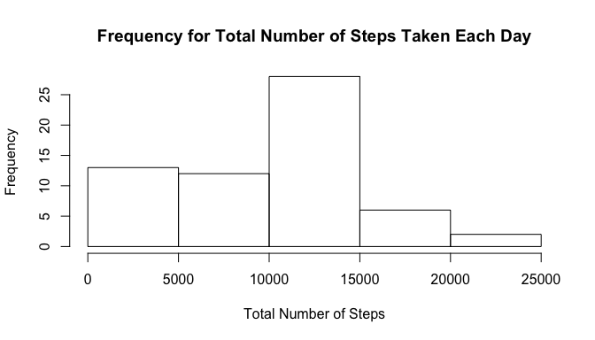
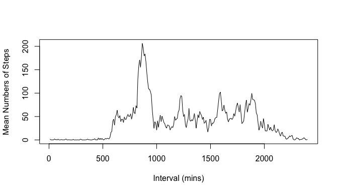
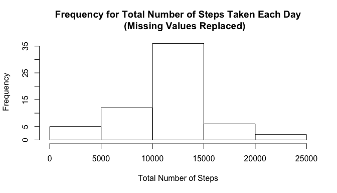
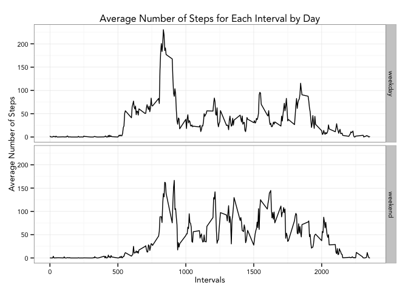

Before everything, load all necessary libraries:

```r
library(knitr)
library(stats)
library(dplyr)
```

```
## 
## Attaching package: 'dplyr'
## 
## The following objects are masked from 'package:stats':
## 
##     filter, lag
## 
## The following objects are masked from 'package:base':
## 
##     intersect, setdiff, setequal, union
```

```r
library(ggplot2)
```

## Loading and preprocessing the data  
Code shown below read the csv file into R data frame.  

```r
activity.raw <- read.csv("./data/activity.csv", na.strings = "NA")
activity.dated <- activity.raw
```
To transform the date column into the date data type, the following code is used.

```r
activity.dated$date <- as.Date(activity.dated[,2], format = "%Y-%m-%d")
```


## What is mean total number of steps taken per day?
First, calculate the total steps taken each day:

```r
day.total <- tapply(activity.raw$steps, activity.raw$date, sum, na.rm = TRUE)
```
Here is the histogram for the calculated results:

```r
hist(day.total, main = "Frequency for Total Number of Steps Taken Each Day",
     xlab = "Total Number of Steps")
```

 
Now, calculating the mean and median total number of steps taken per day:

```r
day.total.mean <- mean(day.total, na.rm = TRUE)
day.total.median <- median(day.total, na.rm = TRUE)
```
The mean and median total number of steps taken per day are 9354.2295082 and 10395, respectively. 

## What is the average daily activity pattern?
The time series plot of the 5-minute interval (x-axis) and the average number of steps taken, averaged across all days (y-axis) is shown below:

```r
m.int <- tapply(activity.raw$steps, activity.raw$interval, mean, na.rm = TRUE)
activity.interval <- data.frame(m.int) 
activity.interval$interval <- rownames(activity.interval)
rownames(activity.interval) <- 1:nrow(activity.interval)
with(activity.interval,{plot(m.int, type = "l", lty = 1, xaxt="n",
                             xlab = "Interval (mins)", 
                             ylab = "Mean Numbers of Steps")})
axis(side = 1, at = c(0, 60, 120, 180, 240), 
     labels = c(0, 500, 1000, 1500, 2000))
```

 
The 5-minute interval that has the maximum average steps taken during the day can be found via:

```r
max.int <- which.max(activity.interval$m.int)
max.value <- activity.interval[max.int, 2]
```
We see that the 835 5-minute interval contains the maximum number of steps

## Imputing missing values

```r
num.na <- sum(is.na(activity.dated$steps))
```
There are 2304 NA values in the dataset
Missing values in the dataset were replaced by the average steps taken for each missing value's respective 5-minute interval.

```r
activity.noNA <- merge(activity.dated, activity.interval, by = "interval")
activity.noNA <- mutate(activity.noNA, step.adj = ifelse(is.na(steps), m.int, 
                                                         steps))
```
Total number of steps taken each day were calculated after missing values were replaced. 

```r
day.total.noNA <- tapply(activity.noNA$step.adj, activity.noNA$date, sum)
```
Results are shown as histogram below

```r
hist(day.total.noNA, main = "Frequency for Total Number of Steps Taken Each Day
     (Missing Values Replaced)", xlab = "Total Number of Steps")
```

 
Calculate mean and median total number of steps taken per day after replacing missing values:

```r
mean.noNA <- mean(day.total.noNA)
median.noNA <- median(day.total.noNA)
```
The mean and median total number of steps taken per day are 1.0766189 &times; 10<sup>4</sup> and 1.0766189 &times; 10<sup>4</sup>, respectively. 
As we could see from above results, imputing missing values affect both the mean and median total number of steps taken per day. The most obvious effect of imputing missing values is to prevent skewness of results, which could be shown by the difference between the mean and median value. As we could see, the mean is equal to median after we replaced missing values with estimates. 

## Are there differences in activity patterns between weekdays and weekends?
To see if steps taken throughout weekdays are different than that of weekends, we need to first create a new data frame consisting average steps for each interval by day, weekday versus weekend:

```r
activity.noNA <- mutate(activity.noNA, day = weekdays(activity.noNA$date))
weekdays <- c('Monday', 'Tuesday', 'Wednesday', 'Thursday', 'Friday')
activity.noNA <- mutate(activity.noNA, weekend.or.weekday = 
                             ifelse((activity.noNA$day == "Saturday" |
                                          activity.noNA$day == "Sunday"), 
                                    "weekend", "weekday"))

weekday.data <- subset(activity.noNA, weekend.or.weekday == "weekday", 
                       select = c(interval, date, step.adj))
day.steps <- tapply(weekday.data$step.adj, weekday.data$interval, mean)
Weekday <- data.frame(day.steps) 
Weekday$interval <- rownames(Weekday)
rownames(Weekday) <- 1:nrow(Weekday)
Weekday <- mutate(Weekday, day = "weekday")

weekend.data <- subset(activity.noNA, weekend.or.weekday == "weekend", 
                       select = c(interval, date, step.adj))
day.steps <- tapply(weekend.data$step.adj, weekend.data$interval, mean)
Weekend <- data.frame(day.steps) 
Weekend$interval <- rownames(Weekend)
rownames(Weekend) <- 1:nrow(Weekend)
Weekend <- mutate(Weekend, day = "weekend")

interval.by.day <- rbind(Weekday, Weekend)
interval.by.day$interval <- as.numeric(as.character(interval.by.day$interval))
```
A panel plot containing a time series plot of the 5-minute interval (x-axis) and the average number of steps taken, averaged across all weekday days or weekend days (y-axis) is shown below:

```r
g <- ggplot(interval.by.day, aes(interval, day.steps, group = 1))
g + geom_line() + facet_grid(day ~ .) + 
     theme_bw(base_family = "Avenir", base_size = 10) + 
     labs(x = "Intervals") + labs(y = "Average Number of Steps") +
     labs(title = "Average Number of Steps for Each Interval by Day") +
     scale_x_continuous(breaks = c(0, 500, 1000, 1500, 2000))
```

 

From the ablove plot, we could see that more steps are taken in the earlier part of the day on weekdays. For weekends, number of steps taken are more evenly distributed across day.
